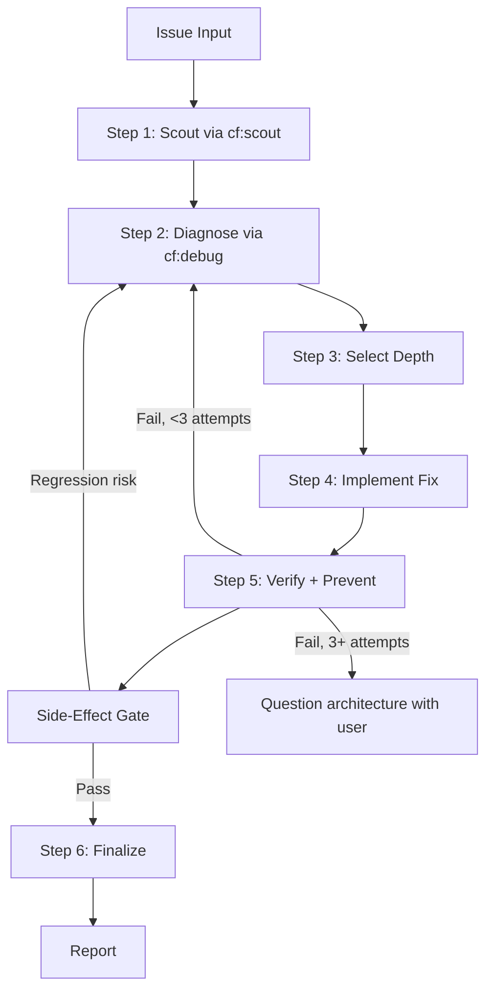

# Fix — root-cause repair workflow

Fix the diagnosed root cause, prove the fix with fresh evidence, and leave no
side effects. Evidence first, fix second.

## Arguments

- `--quick` - Reduced-depth path for trivial issues (lint, type errors, syntax); still scout-first
- `--parallel` - Fix independent issues concurrently, only through the Delegation Gate below
- `--from-debug` - Start from an existing `cf:debug` report and validate its contract before accepting it

Default: deterministic scout-first fix. There is no initial mode selection step.

## Proportional depth

Choose the smallest adequate depth from the diagnosed evidence. Depth vocabulary
follows `cf:debug`:

- **Quick/local:** one deterministic syntax, lint, type, or isolated-test failure
  with obvious local scope. Quick mode only reduces depth; it never skips scout, pre-fix evidence, diagnosis, or before/after verification.
- **Standard:** a diagnosed root cause inside one bounded area. Fix plus a
  regression test that fails without the fix and passes with it.
- **Incident/deep:** production impact, multiple components, intermittent
  behavior, data/security risk, or concurrency. Consume the full Incident/deep
  debug handoff (timeline, elimination path, recurrence candidates), implement in
  stages, and verify each stage.

Depth changes evidence breadth, never the gates: scout, diagnosis, before/after
proof, and the side-effect gate apply at every depth.

## Bounded repair frame

Quick/local does not add a separate framing ceremony when the issue and diagnosis
already establish the repaired behavior and proof. For Standard or Incident/deep,
or whenever scope or risk remains ambiguous after diagnosis, record four short
fields before choosing an implementation:

- **Outcome:** the observable repaired behavior.
- **Constraints:** compatibility, safety, ownership, rollout, and time boundaries.
- **Non-goals:** adjacent behavior the repair must not absorb.
- **Acceptance:** the exact reproduction plus broader evidence that proves completion.

Derive repository-owned facts from scout and diagnosis. Ask the user only for a
missing user-owned decision that could materially change the repair. This frame
does not select a solution, widen the issue into feature work, or run before the
root cause is proven.

<HARD-GATE>
Do not propose or implement a fix before Steps 1-2 (scout + diagnosis) complete.
A symptom patch without a diagnosed root cause is a failed fix.
The exact root-cause contract in Step 2 is mandatory; answer each field in one concrete sentence.
An answer containing 'probably', 'I think', 'something with', or 'maybe' is not an answer; gather evidence instead.
If 3+ fix attempts fail, stop, question the architecture, and discuss with the user.
</HARD-GATE>

<HARD-GATE-SCOUT-FIRST>
Fix always scouts before asking broad clarification questions, forming hypotheses, or changing files.
Collect these scout outputs first:
1. Project type, language(s), framework(s), and package/test runner from repo files.
2. Exact file(s) where the symptom surfaces and their direct callers/dependents.
3. Related tests covering the affected area.
4. Recent commits touching affected files: `git log --oneline -10 -- <affected-files>`.
5. Existing patterns/conventions for this kind of fix.
Then state a concise 3-6 bullet codebase-context summary before Step 2.
Do not ask generic questions before this step unless there is no repo, no error text, and no observable artifact to inspect.
</HARD-GATE-SCOUT-FIRST>

<HARD-GATE-NO-SIDE-EFFECTS>
The fix is not done until Step 5 proves:
1. The original symptom no longer reproduces with the exact pre-fix command/user flow.
2. Modified files and transitively affected modules still pass relevant tests.
3. Blast-radius workflows have no business-logic regression.
4. No new lint/type/build errors were introduced.
5. Public contracts are unchanged unless intentionally called out: function signatures, exported types, response shapes, DB schemas, env vars.

If verification reveals a side effect or regression, stop and present 2-4 concrete options to the user:
- Revert this fix and try a different root-cause angle
- Keep the fix and update <dependent files> to match the new contract
- Narrow the fix to <subset> so the regression disappears
- Accept the change — the old behavior was itself a bug
Do not silently patch around the regression.
</HARD-GATE-NO-SIDE-EFFECTS>

## Delegation Gate

Dispatch subagents (parallel scouts, hypothesis tests, deep research, or
`--parallel` fix trees) only when all three conditions hold:

- The user explicitly requested or permitted delegation or parallel agents.
- The active runtime exposes an Explore/delegation capability.
- The work splits into at least two distinct, non-overlapping scopes with useful independent work.

Otherwise continue sequentially in the main agent with focused local evidence.
Task-tracking tools are an optional visibility fallback, never a required step;
a concise markdown checklist is always sufficient.

## Process Flow



If prose conflicts with this flow, follow the diagram.

---

## Step 1: Scout

Understand the affected codebase before forming any hypotheses. Activate
`cf:scout` or perform an equivalent focused local scout (`rg` plus targeted
reads) to map the blast radius.

| Path | Scout depth |
|------|-------------|
| Quick/local | Minimal - project type, affected file(s), direct callers/dependents, related tests, recent commits |
| Standard and deeper | Full - module boundaries, test coverage, call chains, recent changes, existing patterns |
| `--parallel` | Per-issue independent scouts, one scope each, only through the Delegation Gate |

**Output:** `✓ Step 1: Scouted — [N] files mapped, [M] dependencies, [K] tests found`

---

## Step 2: Diagnose via `cf:debug`

Evidence-based root cause analysis; no guessing. Use `cf:debug`, or validate
an existing debug report when `--from-debug` is provided. See
`references/diagnosis-protocol.md` for the Fix-local checklist.

Diagnosis chain:

1. **Capture pre-fix state:** exact error messages, failing test output, stack traces. This is the baseline for Step 5.
2. **Observe:** read the actual error; locate where it occurs and when it started (`git log -p`).
3. **Hypothesize:** form 2-3 hypotheses, each with confirm/refute evidence and a quick test.
4. **Test:** validate each hypothesis against codebase evidence with focused local reads; test hypotheses in parallel only through the Delegation Gate.
5. **Trace root cause:** symptom → immediate cause → contributing factor → root cause.
6. **Escalate:** if 2+ hypotheses fail, apply `references/escalation-tactics.md`.

**Exact root-cause contract:**
- Symptom: exact observable failure
- Reproduction: command, user flow, CI job, log trigger, or route
- Expected vs actual behavior
- Trigger: event or input that activated the failure, or `unknown`
- Root cause: file:line, config, environment, dependency, or data source
- Contributing factors: conditions that raised likelihood or impact but are not sufficient causes, or `none evidenced`
- Why now: recent change, dependency drift, data state, environment, timing, or load
- Evidence chain: observations proving the cause
- Blast radius: affected files, modules, tests, users, workflows, or release paths

With `--from-debug`, validate the report before accepting it:

- the exact root-cause contract above is complete;
- `Evidence Timeline` is present — a skipped timeline is valid in either producer form (`Timeline: skipped - <reason>` or `- skipped: <reason>`);
- `Elimination Path` records the decisive observation for each removed or retained candidate;
- `Recurrence-Prevention Handoff`, when present, carries evidence-backed candidates only.

A report missing required fields routes back to diagnosis (`cf:debug`); it
does not enter implementation.

If any contract field is vague or missing file:line/config/env evidence, keep
diagnosing or ask the user for the specific missing artifact. Do not implement.

**Output:** `✓ Step 2: Diagnosed — Root cause: [summary], Evidence: [brief], Scope: [N files]`

---

## Step 3: Select Depth + Bound Repair

Apply the Proportional depth rule above. For 2+ independent issues (or
`--parallel`), evaluate the Delegation Gate; when it is closed, fix the issues
sequentially. Track progress with the runtime's task surface when available, or
a markdown checklist otherwise.

For Standard and Incident/deep, complete the bounded repair frame above. Quick
records no separate frame unless scope or risk is still ambiguous.

**Output:** `✓ Step 3: [Depth] selected — [workflow]`

---

## Step 4: Implement Fix

Rules:
- Fix the root cause, not the symptom. Follow diagnosis findings.
- Minimal changes only; follow existing code patterns.
- One logical change per commit boundary.

Workflows by depth:
- **Quick:** apply the minimal fix from completed scout + diagnosis, run the exact pre-fix command plus typecheck/lint immediately, report before/after proof.
- **Standard:** implement the fix, add or update a regression test that fails without the fix and passes with it, run the relevant suite.
- **Incident/deep:** after diagnosis, research only unresolved external facts. If
  multiple cause-aligned remedies or an architecture decision remain, use
  `cf:brainstorm` to compare 2-3 options against the bounded repair frame, then
  write a concise staged implementation plan with dependencies and proof per
  stage. When diagnosis leaves one safe direct repair, skip research and
  brainstorm, record why it satisfies the frame, and implement it. Delegated
  research follows the Delegation Gate; implementation starts only after the
  direction is resolved.
- **Parallel:** one independent issue per agent, each following Steps 1-5, dispatched only through the Delegation Gate; aggregate results on completion.

**Output:** `✓ Step 4: Fixed — [N] files changed`

---

## Step 5: Verify + Prevent

1. **Iron-law verification:** run the exact commands from the pre-fix state capture and compare output. No claims without fresh command output from the current run.
2. **Regression test:** must fail without the fix and pass with it.
3. **Full check:** typecheck + lint + build + test (see `references/parallel-patterns.md` Pattern C).
4. **Prevention guard (Standard+):** see `references/prevention-gate.md`; consume the debug report's recurrence candidates when present.
5. **Side-effect gate:** sweep the full blast radius from Step 2 against the five checks in the gate above.
6. **Review:** trigger `cf:code-review`; see `references/review-cycle.md`.

Verification and review report `PASS | PASS_WITH_WARNINGS | FAIL | BLOCKED`.
The definition of `PASS` defers to `cf:code-review`. `PASS_WITH_WARNINGS`
routes through the same remediation or user-pause path as `FAIL` and never
auto-accepts. `BLOCKED` is terminal for the cycle; resolve the blocker instead
of retrying. A review-only result is not execution proof; completion claims
require fresh command output.

If verification fails: under 3 attempts, loop back to Step 2 and re-diagnose
with the new evidence; at 3+ attempts, stop and discuss with the user. Never
weaken, delete, or mock a failing assertion to obtain green.

**Output:** `✓ Step 5: Verified + Prevented — [before/after comparison], [N] tests added`

---

## Step 6: Finalize

1. **Report:** root cause, changes made, files affected, prevention measures, side-effect sweep result, and any remaining limitations.
2. **Docs update:** if API or behavior changed, update only the affected existing docs through the docs flow.
3. **Commit:** ask the user before committing; use conventional commits.

**Output:** `✓ Step 6: Complete — [action taken]`

---

## Output Format

Unified step markers (emit after each step):
```
✓ Step 1: Scouted — [N] files, [M] deps
✓ Step 2: Diagnosed — Root cause: [summary]
✓ Step 3: [Depth] selected — [workflow]
✓ Step 4: Fixed — [N] files changed
✓ Step 5: Verified + Prevented — [tests added], [guards added]
✓ Step 6: Complete — [action taken]
```

## Specialized Paths

Use `references/workflow-specialized.md` as a progressively disclosed overlay
after Step 1 scout for CI/CD failures, test suite failures, TypeScript type
errors, UI/visual issues, and application log errors. Load only the matching
section. Specialized paths add category-specific evidence and proof; they do
not replace the six-step flow, weaken diagnosis, or broaden the repair scope.

## References

Load as needed:
- `references/diagnosis-protocol.md` — Structured root cause analysis and the exact root-cause contract
- `references/escalation-tactics.md` — What to do when hypotheses fail (Inversion, Scale Game)
- `references/prevention-gate.md` — Defense-in-depth validation after fix
- `references/review-cycle.md` — Review verdict handling and required user-pause conditions
- `references/parallel-patterns.md` — Delegation Gate patterns for parallel work
- `references/workflow-specialized.md` — CI/CD, test, TypeScript, UI-specific workflows
